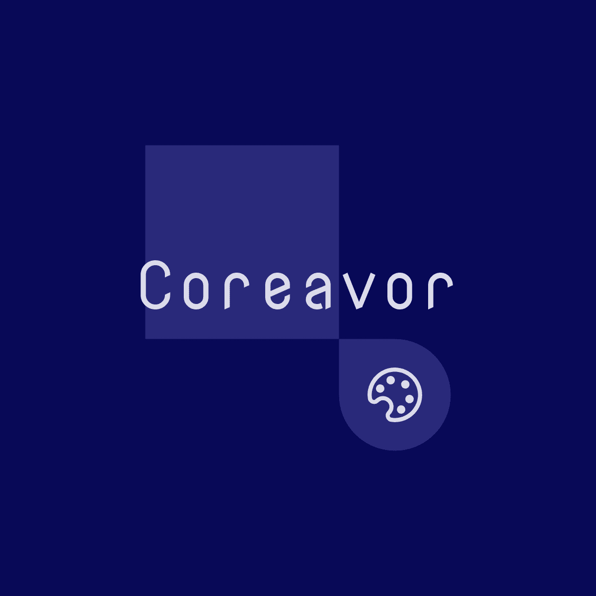

<h1 align="center"> Coreavor </h1>
<p align="center">

  <br />
    <a href="https://lgtm.com/projects/g/Mithil467/Coreavor/context:cpp"></a>
  
</p>

#### What is it?

A simple image viewer.


The UI is inspired from [Eye of Mate](https://github.com/mate-desktop/eom).

#### Features:

- Open image (png, jpg, jpeg, svg, gif)
- Move back and forth in current directory
- Zoom in and out
- Rotate image and save
- View in explorer
- Export image as jpg or png
- "Open image with" in context menu
- Delete image
- Fullscreen
- View properties

#### How to install?

From the [releases](https://github.com/Mithil467/mitpick/releases/latest), download the deb package.
Then from the `Downloads` folder execute with appropriate file name - 
```
sudo apt install ./coreavor_xxx.deb
```

Alternatively, you could also clone the repo and from within the repo execute the following commands.
```
qmake -makefile
sudo make install
make clean
```
Now you can find Coreavor in `Menu` as well as run it from terminal as `Coreavor` or `Coreavor <file name>`

You can also open an image by right clicking and selecting `Open With Coreavor`.

#### Where to get just the executable?

Download the latest version of Coreavor from [releases](https://github.com/Mithil467/mitpick/releases/latest).

#### How to build the executable?

Make sure you have the dependencies required for QT5 installed.
Clone the repo and from within the repo execute the following commands.

```
qmake -makefile
make
make clean
```
This will generate a binary executable `Coreavor`.

#### License

GPL © [Mithil Poojary](https://github.com/Mithil467)
