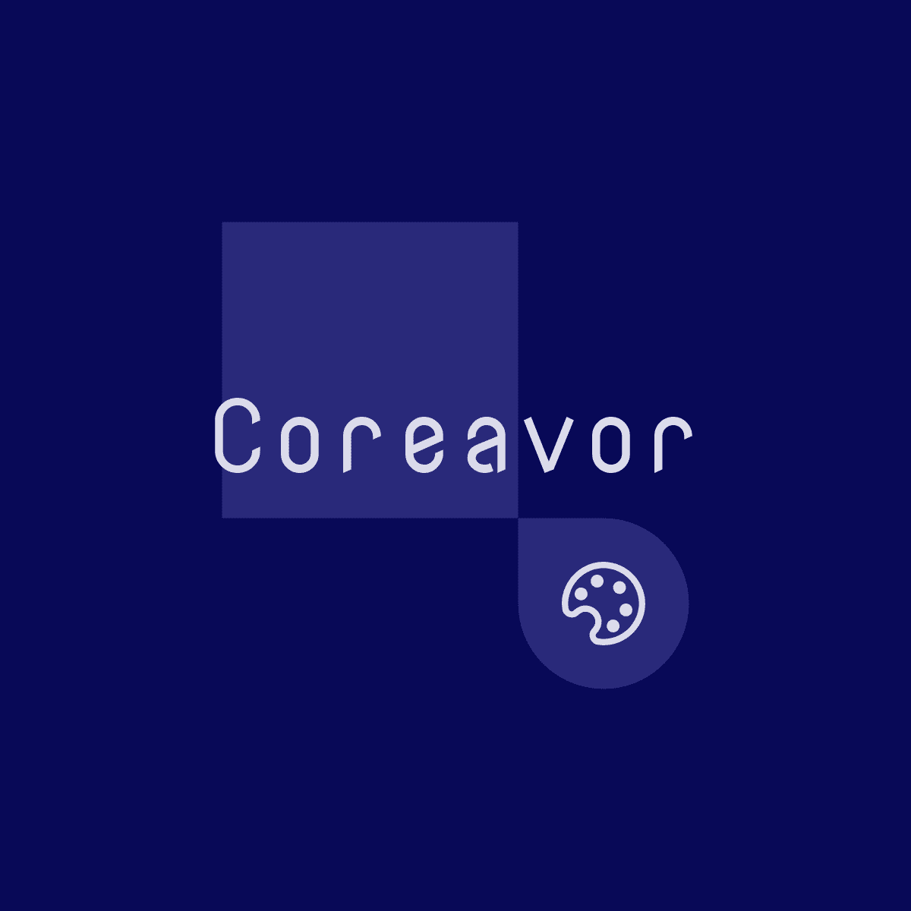

<h1 align="center"> Coreavor </h1>
<p align="center">

  <br />
    <a href="https://lgtm.com/projects/g/Mithil467/Coreavor/context:cpp"></a>
  
</p>

**Coreavor** is an image viewer program written in Qt C++.

## 📷 Screenshot


The UI is inspired from [Eye of Mate](https://github.com/mate-desktop/eom).

## ✨ Main Features

- 🖼️ Open image (png, jpg, jpeg, svg, gif)  
- 💾 Export image as jpg or png  
- 🔍 Zoom in and out  
- 🔄 Rotate image and save  
- 📁 "Open image with" in file manager context menu  
- 🎦 Fullscreen mode  

## 🔧 Install

Install the following prerequisites for your operating system.
- Qt5 library
- C++ compiler

Clone the repo and run -
```
qmake -makefile
sudo make install
make clean
```

## 📈 Usage

Upon installation, you can find Coreavor in `Menu` as well as run it from terminal as `Coreavor` or `Coreavor <file name>`.

You can also open an image by right clicking and selecting `Open With Coreavor` in file manager.

## 💚 Contributing

We encourage you to contribute to Coreavor! Please check out the [Contributing Guidelines](CONTRIBUTING.md) about how to proceed.

## 📜 License

Licensed under the GPL license.
